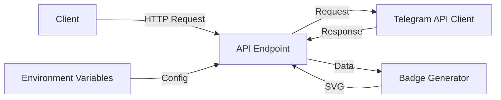

# Design Document

## Overview

Телеграм бейдж представляет собой серверлесс API-функцию, которая генерирует SVG-изображение с информацией о количестве участников в Telegram-группе или канале. Функция будет развернута на платформе Vercel и будет использовать Telegram Bot API для получения данных о группе.

## Architecture

Архитектура решения состоит из следующих компонентов:

1. **API Endpoint** - Serverless функция на Vercel, которая обрабатывает HTTP-запросы
2. **Telegram API Client** - Компонент для взаимодействия с Telegram Bot API
3. **Badge Generator** - Компонент для генерации SVG-изображения бейджа
4. **Configuration** - Компонент для управления конфигурацией и переменными окружения



## Components and Interfaces

### API Endpoint

API-эндпоинт будет обрабатывать HTTP GET-запросы и возвращать SVG-изображение. Он будет принимать следующие параметры запроса:

- `style` (опционально) - стиль бейджа (flat, plastic, flat-square, for-the-badge, social)
- `label` (опционально) - текст метки бейджа (по умолчанию "Telegram")
- `color` (опционально) - цвет основной части бейджа (по умолчанию "#2AABEE" - цвет Telegram)
- `labelColor` (опционально) - цвет метки бейджа (по умолчанию "#555555")

### Telegram API Client

Компонент для взаимодействия с Telegram Bot API будет использовать метод `getChatMemberCount` для получения количества участников в группе или канале. Он будет использовать BOT_TOKEN и CHAT_ID из переменных окружения.

### Badge Generator

Компонент для генерации SVG-изображения бейджа будет использовать библиотеку `badge-maker` для создания стилизованного бейджа на основе полученных данных и параметров запроса.

### Configuration

Компонент для управления конфигурацией будет считывать следующие переменные окружения:

- `BOT_TOKEN` - токен Telegram бота
- `CHAT_ID` - идентификатор группы или канала

## Data Models

### Request Parameters

```typescript
interface BadgeRequestParams {
  style?: 'flat' | 'plastic' | 'flat-square' | 'for-the-badge' | 'social';
  label?: string;
  color?: string;
  labelColor?: string;
}
```

### Telegram API Response

```typescript
interface TelegramApiResponse {
  ok: boolean;
  result?: number;
  description?: string;
}
```

### Badge Format

```typescript
interface BadgeFormat {
  label: string;
  message: string;
  color: string;
  labelColor: string;
  style: string;
}
```

## Error Handling

Система будет обрабатывать следующие типы ошибок:

1. **Отсутствие переменных окружения** - Если BOT_TOKEN или CHAT_ID отсутствуют, система вернет ошибку 500 с сообщением "Missing BOT_TOKEN or CHAT_ID"
2. **Ошибки Telegram API** - Если Telegram API вернет ошибку, система вернет ошибку 500 с сообщением "Telegram API error: {description}"
3. **Серверные ошибки** - Если произойдет непредвиденная ошибка, система вернет ошибку 500 с сообщением "Server error: {message}"

## Testing Strategy

Для тестирования системы будут использоваться следующие подходы:

1. **Модульное тестирование** - Тестирование отдельных компонентов системы
2. **Интеграционное тестирование** - Тестирование взаимодействия компонентов
3. **End-to-end тестирование** - Тестирование полного цикла работы системы

### Тестовые сценарии

1. **Успешное получение бейджа** - Проверка, что система возвращает корректный SVG-бейдж при правильных параметрах
2. **Кастомизация бейджа** - Проверка, что система корректно применяет параметры стилизации
3. **Обработка ошибок** - Проверка, что система корректно обрабатывает различные типы ошибок
4. **Производительность** - Проверка, что система обрабатывает запросы за разумное время
5. **Кэширование** - Проверка, что система устанавливает корректные заголовки кэширования