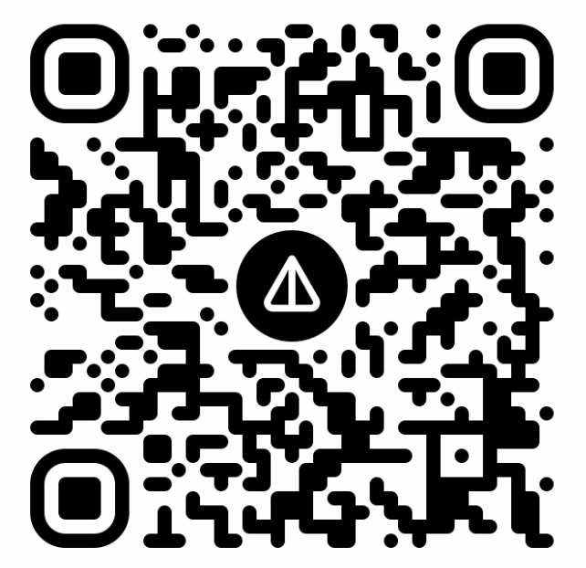

# مولد شارات تيليجرام

[🇺🇸 English](README.md) | [🇷🇺 Русский](README.ru.md) | [🇩🇪 Deutsch](README.de.md) | [🇫🇷 Français](README.fr.md) | [🇪🇸 Español](README.es.md) | [🇵🇹 Português](README.pt.md) | [🇯🇵 日本語](README.ja.md) | [🇰🇷 한국어](README.ko.md) | [🇹🇭 ไทย](README.th.md) | [🇨🇳 中文](README.zh.md)

[](https://github.com/chatman-media/telegram-badge/actions)
[](https://github.com/chatman-media/telegram-badge/actions)
[](https://www.npmjs.com/package/telegram-badge)
[](https://jsr.io/@chatman-media/telegram-badge)
[](https://bundlephobia.com/package/telegram-badge)
[](https://www.typescriptlang.org/)
[](https://opensource.org/licenses/MIT)

[](https://github.com/chatman-media/telegram-badge)
[](https://dev.to/chatman-media/show-your-telegram-group-member-count-in-github-readme-46pl)
[](https://x.com/chatman_media/status/1947399700795244694)

هذا المشروع ينشئ شارات SVG بعدد أعضاء مجموعات وقنوات التيليجرام الحالي الخاص بك. مثالي لعرض نشاط المجتمع في ملفات README على GitHub أو على المواقع.

## البدء السريع

فقط استخدم معلمات URL لإنشاء شارات لأي مجموعة أو قناة تيليجرام:

```
https://telegram-badge.vercel.app/api/telegram-badge?channelId=@your_channel_or_group
```


---

## المكدس التكنولوجي

- Node.js / TypeScript
- Telegram Bot API
- Vercel (Serverless API)
- Jest للاختبار

---

## الاستخدام

### الطريقة الأساسية: معلمات URL (لا يتطلب إعداد!)

فقط أضف معرف مجموعة/قناة التيليجرام الخاص بك إلى URL:

```markdown

```

**الكيانات المدعومة:**
- القنوات العامة (مثال: `@your_channel`)
- المجموعات العامة (مثال: `@your_group`)
- المجموعات/القنوات الخاصة (استخدم المعرف الرقمي مثل `-1001234567890`)

هذا كل شيء! لا حاجة للنشر، لا حاجة لرمز البوت للقنوات والمجموعات العامة.

### الطريقة البديلة: الاستضافة الذاتية

للمستخدمين المتقدمين الذين يرغبون في استضافة نسختهم الخاصة:

#### 1. المتطلبات الأساسية
- رمز بوت التيليجرام (أنشئه عبر [@BotFather](https://t.me/botfather))
- حساب Vercel (أو أي استضافة Node.js)

#### 2. النشر على Vercel

[](https://vercel.com/new/clone?repository-url=https%3A%2F%2Fgithub.com%2Fchatman-media%2Ftelegram-badge)

قم بتعيين متغيرات البيئة:
- `BOT_TOKEN`: رمز بوت التيليجرام الخاص بك
- `CHAT_ID`: معرف الدردشة الافتراضي (اختياري إذا كنت تستخدم معلمات URL)

#### 3. التطوير المحلي

```bash
git clone https://github.com/chatman-media/telegram-badge.git
cd telegram-badge
npm install

# إنشاء ملف .env
echo "BOT_TOKEN=your_bot_token" > .env
echo "CHAT_ID=@your_channel" >> .env

npm run dev
```

### معلمات التنسيق

يمكنك تخصيص مظهر الشارة باستخدام المعلمات التالية:

| المعلمة | الوصف | القيمة الافتراضية |
|-----------|-------------|------------------------|
| `channelId` | معرف أو اسم مستخدم دردشة التيليجرام (مثال: `@timelinestudiochat`) | من البيئة |
| `style` | نمط الشارة | `flat` |
| `label` | نص التسمية | `Telegram` |
| `color` | لون الشارة الرئيسي | `2AABEE` (لون التيليجرام) |
| `labelColor` | لون التسمية | `555555` |
| `logo` | إظهار شعار التيليجرام | `true` |

#### الأنماط المتاحة:

- `flat` - نمط مسطح (افتراضي)
- `plastic` - نمط بلاستيكي مع تدرج
- `flat-square` - نمط مسطح مربع بدون زوايا مستديرة
- `for-the-badge` - نمط عريض مع أحرف كبيرة
- `social` - نمط اجتماعي GitHub

#### أمثلة:

الشارة القياسية (نمط flat):
```
https://telegram-badge.vercel.app/api/telegram-badge?channelId=@your_channel
```


شارة بنمط plastic:
```
https://telegram-badge.vercel.app/api/telegram-badge?channelId=@your_channel&style=plastic
```


شارة بنمط flat-square:
```
https://telegram-badge.vercel.app/api/telegram-badge?channelId=@your_channel&style=flat-square
```


شارة بنمط for-the-badge:
```
https://telegram-badge.vercel.app/api/telegram-badge?channelId=@your_channel&style=for-the-badge
```


شارة بنمط social:
```
https://telegram-badge.vercel.app/api/telegram-badge?channelId=@your_channel&style=social
```


شارة بتسمية ولون مخصصين:
```
https://telegram-badge.vercel.app/api/telegram-badge?channelId=@your_channel&label=انضم%20للدردشة&color=00FF00
```


شارة مخصصة بالكامل:
```
https://telegram-badge.vercel.app/api/telegram-badge?channelId=@your_channel&style=for-the-badge&label=المجتمع&color=FF5733&labelColor=1A1A1A
```


شارة بدون شعار:
```
https://telegram-badge.vercel.app/api/telegram-badge?channelId=@your_channel&logo=false
```


شارة لقناة محددة:
```
https://telegram-badge.vercel.app/api/telegram-badge?channelId=@your_channel
```

شارة بتنسيق مخصص:
```
https://telegram-badge.vercel.app/api/telegram-badge?channelId=@your_channel&style=for-the-badge&color=FF5733
```

## المميزات

- 👥 عرض عدد الأعضاء في الوقت الفعلي
- 🔗 معلمات URL المباشرة - لا يتطلب إعداد!
- 🎨 تخصيص كامل لمظهر الشارة
- 🔒 الاستضافة الذاتية الاختيارية مع تخزين آمن للرموز
- ⚡ التخزين المؤقت المحسّن للتحميل السريع
- 🛡️ معالجة الأخطاء مع رسائل إعلامية
- 🆓 مجاني الاستخدام
- 📡 يمكن توسيعه لعرض النشاط/عدد الرسائل
- 🧪 مجموعة اختبار شاملة مع TypeScript

## استخدام API

### كحزمة npm:

```bash
npm install telegram-badge
```

```typescript
import badgeHandler from 'telegram-badge';

// استخدم في دالة الخادم الخاصة بك
export default badgeHandler;
```

### مكالمات API المباشرة:

```typescript
GET /api/telegram-badge?style=flat&label=الأعضاء&color=2AABEE&labelColor=555555
```

## الاختبار

تشغيل مجموعة الاختبارات:

```bash
npm test
```

## المساهمة

1. قم بعمل Fork للمستودع
2. أنشئ فرع ميزة (`git checkout -b feature/amazing-feature`)
3. قم بتثبيت تغييراتك (`git commit -m 'Add some amazing feature'`)
4. ادفع الفرع (`git push origin feature/amazing-feature`)
5. افتح طلب سحب (Pull Request)

## اشترك

[](https://www.tiktok.com/@chatman.media)
[](https://www.twitch.tv/chatman1984)
[](https://www.youtube.com/@chatman-media)
[](https://t.me/alexanderkireyev)
[](https://x.com/chatman_media)

## الدعم 💝🚀

- **BTC:** 14s9Y9Rb2CUWHSAatiQMhfkpx1MWXofUzw
- **TON:** UQD1M80nPyzph5ZW1vfp_r19XI5MaerNhDq4dWXbXCo96WFj
- **NOT:** UQD1M80nPyzph5ZW1vfp_r19XI5MaerNhDq4dWXbXCo96WFj
- **ETH:** 0x286D65151b622dCC16624cEd8463FDa45585fd60

<div align="center">
  <table>
    <tr>
      <td></td>
      <td></td>
      <td></td>
      <td></td>
    </tr>
  </table>
</div>

## تاريخ النجوم

<a href="https://www.star-history.com/#chatman-media/telegram-badge&Date">
 <picture>
   <source media="(prefers-color-scheme: dark)" srcset="https://api.star-history.com/svg?repos=chatman-media/telegram-badge&type=Date&theme=dark" />
   <source media="(prefers-color-scheme: light)" srcset="https://api.star-history.com/svg?repos=chatman-media/telegram-badge&type=Date" />
   
 </picture>
</a>

## نشاط المستودع


## الرخصة

هذا المشروع مرخّص بموجب رخصة MIT - راجع ملف [LICENSE](LICENSE) لمزيد من التفاصيل.

---

صنع بحب من قبل [Chatman Media](https://github.com/chatman-media)