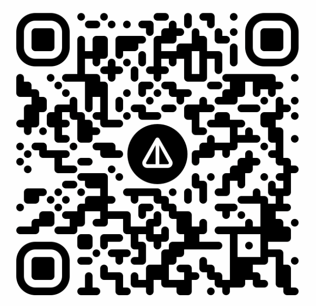

# Telegram Group Badge Generator

[🇷🇺 Русский](README.ru.md) | [🇺🇸 English](README.md) | [🇨🇳 中文](README.zh.md) | [🇹🇭 ไทย](README.th.md) | [🇸🇦 العربية](README.ar.md) | [🇯🇵 日本語](README.ja.md) | [🇰🇷 한국어](README.ko.md)

[](https://github.com/chatman-media/telegram-badge/actions)
[](https://github.com/chatman-media/telegram-badge/actions)
[](https://www.npmjs.com/package/telegram-badge)
[](https://jsr.io/@chatman-media/telegram-badge)
[](https://deno.land/)
[](https://bundlephobia.com/package/telegram-badge)
[](https://www.typescriptlang.org/)
[](https://opensource.org/licenses/MIT)

[](https://github.com/chatman-media/telegram-badge)
[](https://dev.to/chatman-media/show-your-telegram-group-member-count-in-github-readme-46pl)
[](https://x.com/chatman_media/status/1947399700795244694)

Этот проект генерирует SVG-бейдж с текущим количеством участников вашей Telegram-группы. Идеально подходит для отображения активности сообщества в README на GitHub или на сайте.

## 🚀 Быстрый старт

Просто используйте параметры URL для генерации бейджей для любого Telegram-канала или группы:

```
https://telegram-badge.vercel.app/api/telegram-badge?channelId=@your_channel
```


---

## 📦 Стек

- Node.js / TypeScript
- Telegram Bot API
- Vercel (Serverless API)
- Jest для тестирования

---

## 🧩 Использование

### Основной метод: параметры URL (настройка не требуется!)

Просто добавьте ID вашего Telegram-канала/группы к URL:

```markdown

```

Вот и всё! Не нужно разворачивать проект, не нужен токен бота.

### Альтернативный метод: самостоятельный хостинг

Для продвинутых пользователей, которые хотят развернуть собственный экземпляр:

#### 1. Предварительные требования
- Токен Telegram-бота (создайте через [@BotFather](https://t.me/botfather))
- Аккаунт Vercel (или любой хостинг Node.js)

#### 2. Деплой на Vercel

[](https://vercel.com/new/clone?repository-url=https%3A%2F%2Fgithub.com%2Fchatman-media%2Ftelegram-badge)

Установите переменные окружения:
- `BOT_TOKEN`: Токен вашего Telegram-бота
- `CHAT_ID`: ID чата по умолчанию (необязательно при использовании параметров URL)

#### 3. Локальная разработка

```bash
git clone https://github.com/chatman-media/telegram-badge.git
cd telegram-badge
npm install

# Создайте .env файл
echo "BOT_TOKEN=your_bot_token" > .env
echo "CHAT_ID=@your_channel" >> .env

npm run dev
```

### 🎨 Параметры стилизации

Вы можете настроить внешний вид бейджа с помощью следующих параметров:

| Параметр | Описание | Значение по умолчанию |
|----------|----------|------------------------|
| `channelId` | ID или имя пользователя Telegram-чата (например, `@timelinestudiochat`) | Из окружения |
| `style` | Стиль бейджа | `flat` |
| `label` | Текст метки | `Telegram` |
| `color` | Цвет основной части бейджа | `2AABEE` (цвет Telegram) |
| `labelColor` | Цвет метки бейджа | `555555` |
| `logo` | Показывать логотип Telegram | `true` |

#### Доступные стили:

- `flat` - плоский стиль (по умолчанию)
- `plastic` - объемный стиль с градиентом
- `flat-square` - плоский стиль без закруглений
- `for-the-badge` - широкий стиль с заглавными буквами
- `social` - стиль как у GitHub

#### Примеры:

Стандартный бейдж (стиль flat):
```
https://telegram-badge.vercel.app/api/telegram-badge?channelId=@your_channel
```


Бейдж со стилем plastic:
```
https://telegram-badge.vercel.app/api/telegram-badge?channelId=@your_channel&style=plastic
```


Бейдж со стилем flat-square:
```
https://telegram-badge.vercel.app/api/telegram-badge?channelId=@your_channel&style=flat-square
```


Бейдж со стилем for-the-badge:
```
https://telegram-badge.vercel.app/api/telegram-badge?channelId=@your_channel&style=for-the-badge
```


Бейдж со стилем social:
```
https://telegram-badge.vercel.app/api/telegram-badge?channelId=@your_channel&style=social
```


Бейдж с кастомной меткой и цветом:
```
https://telegram-badge.vercel.app/api/telegram-badge?channelId=@your_channel&label=Наш%20Чат&color=00FF00
```


Полностью кастомизированный бейдж:
```
https://telegram-badge.vercel.app/api/telegram-badge?channelId=@your_channel&style=for-the-badge&label=Сообщество&color=FF5733&labelColor=1A1A1A
```


Бейдж без логотипа:
```
https://telegram-badge.vercel.app/api/telegram-badge?channelId=@your_channel&logo=false
```


Бейдж для конкретного канала:
```
https://telegram-badge.vercel.app/api/telegram-badge?channelId=@your_channel
```

Бейдж с пользовательским стилем:
```
https://telegram-badge.vercel.app/api/telegram-badge?channelId=@your_channel&style=for-the-badge&color=FF5733
```

## ✨ Возможности

- 👥 Отображение количества участников в реальном времени
- 🔗 Прямые параметры URL - настройка не требуется!
- 🎨 Полная кастомизация внешнего вида бейджа
- 🔒 Опциональный самостоятельный хостинг с безопасным хранением токенов
- ⚡ Оптимизированное кэширование для быстрой загрузки
- 🛡️ Обработка ошибок с информативными сообщениями
- 🆓 Бесплатное использование
- 📡 Можно расширить до отображения активности / количества сообщений
- 🧪 Полный набор тестов с TypeScript

## 🔧 Использование API

### Как npm пакет:

```bash
npm install telegram-badge
```

```typescript
import badgeHandler from 'telegram-badge';

// Используйте в вашей serverless функции
export default badgeHandler;
```

### Как Deno/JSR пакет:

```bash
# Используя JSR
deno add @chatman-media/telegram-badge

# Или импортируйте напрямую
import badgeHandler from "jsr:@chatman-media/telegram-badge";
```

```typescript
import badgeHandler from "@chatman-media/telegram-badge";

// Используйте в вашей Deno serverless функции
export default badgeHandler;
```

### Прямые вызовы API:

```typescript
GET /api/telegram-badge?style=flat&label=Участники&color=2AABEE&labelColor=555555
```

## 🧪 Тестирование

Запустить тесты:

```bash
npm test
```

Проверка типов:

```bash
npm run type-check
```

Сборка проекта:

```bash
npm run build
```

## История звёзд

<a href="https://www.star-history.com/#chatman-media/telegram-badge&Date">
 <picture>
   <source media="(prefers-color-scheme: dark)" srcset="https://api.star-history.com/svg?repos=chatman-media/telegram-badge&type=Date&theme=dark" />
   <source media="(prefers-color-scheme: light)" srcset="https://api.star-history.com/svg?repos=chatman-media/telegram-badge&type=Date" />
   
 </picture>
</a>

## 🤝 Внести вклад

1. Форкните репозиторий
2. Создайте ветку для новой функции (`git checkout -b feature/amazing-feature`)
3. Зафиксируйте изменения (`git commit -m 'Add some amazing feature'`)
4. Отправьте ветку (`git push origin feature/amazing-feature`)
5. Откройте Pull Request

## Подписывайтесь

[](https://www.tiktok.com/@chatman.media)
[](https://www.twitch.tv/chatman1984)
[](https://www.youtube.com/@chatman-media)
[](https://t.me/alexanderkireyev)
[](https://x.com/chatman_media)

## Поддержка 💝🚀

- **BTC:** 14s9Y9Rb2CUWHSAatiQMhfkpx1MWXofUzw
- **TON:** UQD1M80nPyzph5ZW1vfp_r19XI5MaerNhDq4dWXbXCo96WFj
- **NOT:** UQD1M80nPyzph5ZW1vfp_r19XI5MaerNhDq4dWXbXCo96WFj
- **ETH:** 0x286D65151b622dCC16624cEd8463FDa45585fd60

<div align="center">
  <table>
    <tr>
      <td></td>
      <td></td>
      <td></td>
      <td></td>
    </tr>
  </table>
</div>

## Активность репозитория


## 📜 Лицензия

Этот проект лицензирован под лицензией MIT - подробности в файле [LICENSE](LICENSE).

---

Сделано с ❤️ от [Chatman Media](https://github.com/chatman-media)